## Лабораторная работа №1: Разработка пользовательского интерфейса (GUI) для языкового процессора
**Тема:** разработка текстового редактора с возможностью дальнейшего расширения функционала до языкового процессора.

**Цель работы:** разработать приложение с графическим интерфейсом пользователя, способное редактировать текстовые данные. Это приложение будет базой для будущего расширения функционала в виде языкового процессора.

**Выполнил:** Студент 3 курса, группа АВТ-314, Ткачук Фёдор

### Описание проекта
Разработка компилятора с графичексим интерфейсом с обязательным функционалом интерфейса:

**Основное меню программы, в который входит такой функционал:**
  
| Раздел | Команда | Способ вызова | Описание |
| --- | --- | --- | --- |
| **Файл** | Создать | Меню / Тулбар | Создает новый документ. |
|  | Открыть | Меню / Тулбар | Открывает файл с диска. |
|  | Сохранить | Меню / Тулбар | Сохраняет текущий файл. |
|  | Сохранить как | Меню | Сохраняет файл по новому пути. |
|  | Выход | Меню | Закрывает приложение с проверкой сохранений. |
| **Правка** | Отменить | Меню / Тулбар | Отмена последнего действия. |
|  | Вернуть | Меню / Тулбар | Возврат отмененного действия. |
|  | Копировать | Меню / Тулбар | Копирование текста в буфер. |
|  | Вырезать | Меню / Тулбар | Вырезание текста. |
|  | Вставить | Меню / Тулбар | Вставка из буфера. |
|  | Удалить | Меню | Удаление выделенного текста. |
|  | Выделить все | Меню | Выделение всего текста в редакторе. |
| **Текст** | (Все пункты) | Меню | Меню текст будет реализовано позже. |
| **Пуск** | Запуск | Меню / Тулбар | Будет реализовано позже. |
| **Справка** | Вызов справки | Меню | Вызов справочной системы. |
|  | О программе | Меню |
 
    

- Панель инструментов с кнопками для быстрого доступа к часто используемым функциям.
- Область ввода/редактирования текста (текстовый редактор).
- Область отображения результатов работы языкового процессора (только для вывода, без возможности редактирования).

### Используемые технологии
**Язык программирования**: С# версии .NET 8.0  
**Фреймворк**: Windows Forms  
**Среда разработки**: Microsoft Visual Studio 2022, версии 17.8.3, издание Community  

### Интерфейс текстового редактора

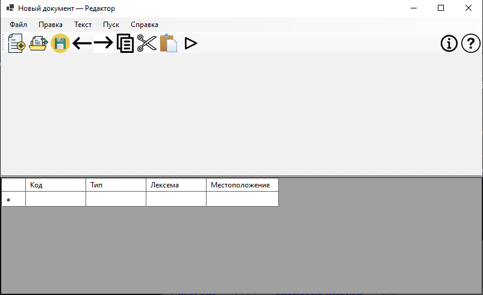

#### Получившийся текстовый редактор имеет следующие элементы:

1. Меню
   | Пункт меню | Подпункты |
   | ------ | ------ |
   | Файл | 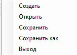 |
   | Правка | 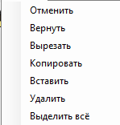 |
   | Текст | 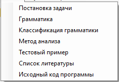 |
   | Пуск | — |
   | Справка | 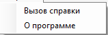 |
2. Панель инструментов
   
   

   - Создать
   - Открыть
   - Сохранить
   - Отменить
   - Вернуть
   - Копировать
   - Вырезать
   - Вставить
   - Пуск
   - Вызов справки
   - О программе
3. Область редактирования

   На данном этапе имеется возможность только:
   - Произвольно редактировать текстовые документы
   
4. Область отображения результатов

   В области отображения результатов своство Readonly имеет состояние True, также заготовленна таблица для выведения ошибок


### Справочная система

Разделы справочной системы открываются как HTML-документы в браузере.

| Раздел | Изображение |
| ------ | ------ |
| Справка | 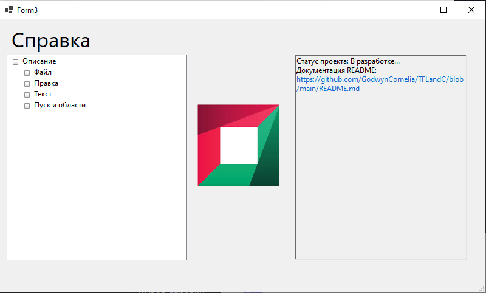 |
| О программе | 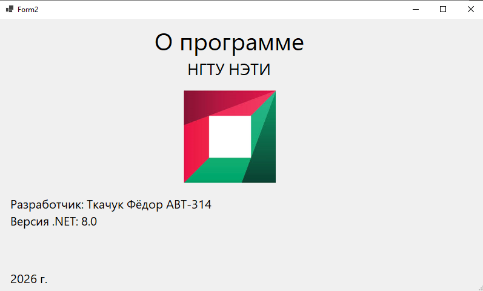 |

### Вывод сообщений

| Сообщение | Описание | Изображение |
| ------ | ------| ------ |
| Закрытие окна программы | Появляется при закрытии программы нажатием крестика или комбинацией клавиш при наличии несохраненных изменений | 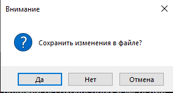 |
| Сохранение изменений | Появляется при попытке открыть существующий файл или создать новый при наличии несохраненных изменений |  |

## Инструкция по сборке и запуску

1. **Клонирование репозитория:**
```bash
git clone [ссылка_на_репозиторий]
```

2. **Открытие проекта:**
Откройте файл решения `.sln` в среде разработки **Visual Studio**.
3. **Сборка (Single File EXE):**
Выполните следующую команду в терминале (в корневой папке проекта):
```bash
dotnet publish -c Release -r win-x64 --self-contained true /p:PublishSingleFile=true
```

4. **Запуск:**
Готовый исполняемый файл, не требующий установки .NET Runtime, находится по пути:
`./bin/Release/net8.0-windows/win-x64/publish/Compiler.exe`

### Ограничения
ОС: Windows 10 и новее 64-х битная.

# Лабораторная работа №2. Разработка лексического анализатора (сканера)

### Цель работы
Изучить назначение и принципы работы лексического анализатора в структуре компилятора. Спроектировать алгоритм (диаграмму состояний) и выполнить программную реализацию сканера для выделения лексем из входного текста. Интегрировать разработанный модуль в ранее созданный графический интерфейс языкового процессора.

## Сведения об авторе
* **ФИО:** Ткачук Фёдор Андреевич
* **Группа:** АВТ-314
* **Учебное заведение:** НГТУ

## Постановка задачи
Разработать модуль лексического анализатора (сканера) и интегрировать его в графический интерфейс (GUI), созданный в Лабораторной работе №1. Модуль должен принимать строку текста, разделять её на токены согласно правилам языка и выводить результат в структурированную таблицу.

## Вариант задания
* **Вариант:** 60
* **Описание:** Объявление и инициализация строковой константы на языке Rust.
* **Разрешенные лексемы:**
  * `Code 1` (KEYWORD): Ключевое слово `const`.
  * `Code 2` (IDENTIFIER): Имена констант (только английские буквы, цифры и подчеркивание, начинается не с цифры).
  * `Code 3` (TYPE): Тип данных `&str`.
  * `Code 4` (WHITESPACE): Символ пробела.
  * `Code 5` (DELIMITER): Разделитель типа `:`.
  * `Code 6` (OPERATOR): Оператор присваивания `=`.
  * `Code 7` (STRING): Строковый литерал в двойных кавычках `"..."`.
  * `Code 8` (TERMINATOR): Оператор конца строки `;`.

**Примеры допустимых входных строк:**
1. `const NAME: &str = "GFG";`
2. `const VERSION: &str = "d.0!1";`

## Диаграмма состояний
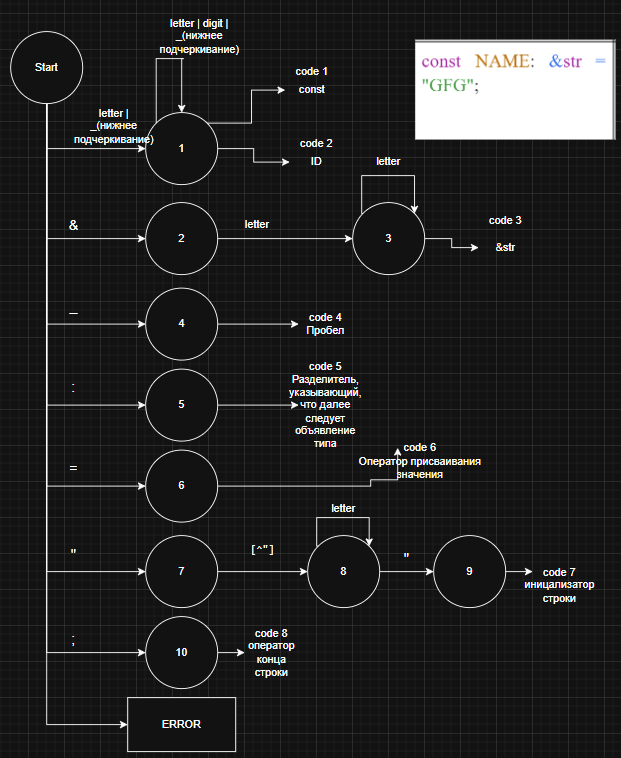

**Краткое описание принципа работы автомата:**
1. **Начало:** Автомат считывает первый символ и выбирает ветку в зависимости от его типа (буква, кавычка, спецсимвол или пробел).
2. **Идентификаторы:** При считывании буквы автомат переходит в состояние накопления слова. После завершения слова происходит проверка: является ли оно ключевым (`const`) или обычным именем.
3. **Строки:** При встрече кавычки автомат переходит в цикл накопления любых символов до тех пор, пока не встретит закрывающую кавычку.
4. **Тип данных:** Ветка для `&str` проверяет последовательное наличие символов `&`, `s`, `t`, `r`.
5. **Ошибки:** Если встречен символ, не предусмотренный грамматикой (например, русские буквы), автомат переходит в состояние **ERROR (Code 99)**.

## Тестовые примеры

### 1. Корректная строка
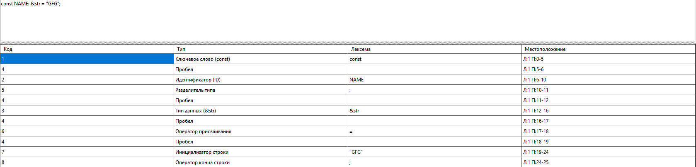

### 2. Строка с незакрытой ковычкой
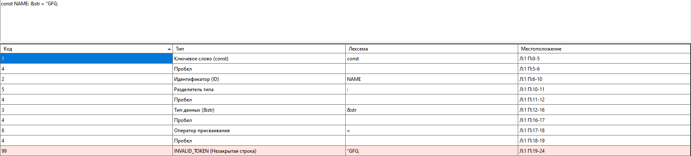

### 3. Строка состоящая из букв/цифр/других символов
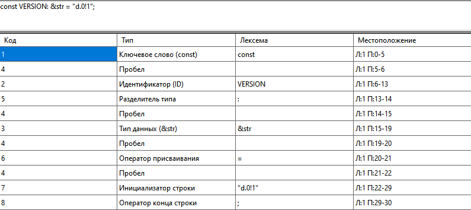


## Лабораторная работа 3. Разработка синтаксического анализатора (парсера)

### Цель работы

Изучить назначение и принципы работы синтаксического анализатора в структуре компилятора. Спроектировать грамматику, построить соответствующую схему метода анализа грамматики и выполнить программную реализацию парсера с нейтрализацией синтаксических ошибок методом Айронса. Интегрировать разработанный модуль в ранее созданный графический интерфейс языкового процессора.

### Постановка задачи

Разработать синтаксический анализатор для объявлений строковых констант в Rust. Парсер должен принимать поток лексем, проверять их на соответствие грамматике и, в случае обнаружения ошибок, нейтрализовать их методом Айронса.

### Разработка грамматики

<div>
    <p>G[Z]={Vt,Vn,Z,P}<br />Vt={const, :, &str, space, =, ", ;, [^"]}<br />Vn={Z,  ID, Bodystring, IDRest,BodyStringRest,IDStart, BodyStringStart, QuoteOpen, CloseQuote,BodyString, TypeStart}</p>
    <p>P = {<br /><li><span class="non-terminal">&lt;Z&gt;</span> &rarr; <span class="terminal">const</span> <span class="non-terminal">&lt;Space1&gt;</span></li>
            <li><span class="non-terminal">&lt;Space1&gt;</span> &rarr; <span class="terminal">space</span> <span class="non-terminal">&lt;IDStart&gt;</span></li>
            <li><span class="non-terminal">&lt;IDStart&gt;</span> &rarr; <span class="terminal">_</span> <span class="non-terminal">&lt;IDRest&gt;</span> | <span class="terminal">Б</span> <span class="non-terminal">&lt;IDRest&gt;</span></li>
            <li><span class="non-terminal">&lt;IDRest&gt;</span> &rarr; <span class="terminal">_</span> <span class="non-terminal">&lt;IDRest&gt;</span> | <span class="terminal">Б</span> <span class="non-terminal">&lt;IDRest&gt;</span> | <span class="terminal">Ц</span> <span class="non-terminal">&lt;IDRest&gt;</span> | <span class="terminal">:</span> <span class="non-terminal">&lt;TypeStart&gt;</span></li>
            <li><span class="non-terminal">&lt;TypeStart&gt;</span> &rarr; <span class="terminal">&str</span> <span class="non-terminal">&lt;Eq&gt;</span></li>
            <li><span class="non-terminal">&lt;Eq&gt;</span> &rarr; <span class="terminal">=</span> <span class="non-terminal">&lt;QuateOpen&gt;</span></li>
            <li><span class="non-terminal">&lt;QuateOpen&gt;</span> &rarr; <span class="terminal">"</span> <span class="non-terminal">&lt;BodyString&gt;</span></li>
            <li><span class="non-terminal">&lt;BodyString&gt;</span> &rarr; <span class="terminal">[^"]</span> <span class="non-terminal">&lt;BodyStringRest&gt;</span></li>
            <li><span class="non-terminal">&lt;BodyStringRest&gt;</span> &rarr; <span class="terminal">[^"]</span> <span class="non-terminal">&lt;BodyStringRest&gt;</span> | <span class="terminal">"</span> <span class="non-terminal">&lt;CloseQuote&gt;</span></li>
            <li><span class="non-terminal">&lt;CloseQuote&gt;</span> &rarr; <span class="terminal">;</span> <span class="terminal">END</span></li>}</p>
</div>

### Классификация грамматики

Согласно классификации Хомского, грамматика G[Z] является полностью автоматной.

### Метод анализа

Граф конечного автомата
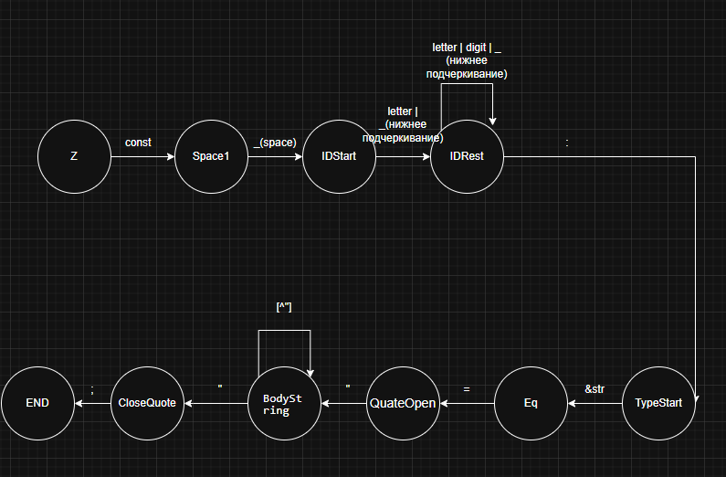

### Диагностика и нейтрализация синтаксических ошибок

**Метод Айронса**<br>
Разрабатываемый синтаксический анализатор построен на базе автоматной грамматики. При нахождении лексемы, которая не соответствует грамматике предлагается свести алгоритм нейтрализации к последовательному удалению следующего символа во входной цепочке до тех пор, пока следующий символ не окажется одним из допустимых в данный момент разбора.

### Тестовые примеры

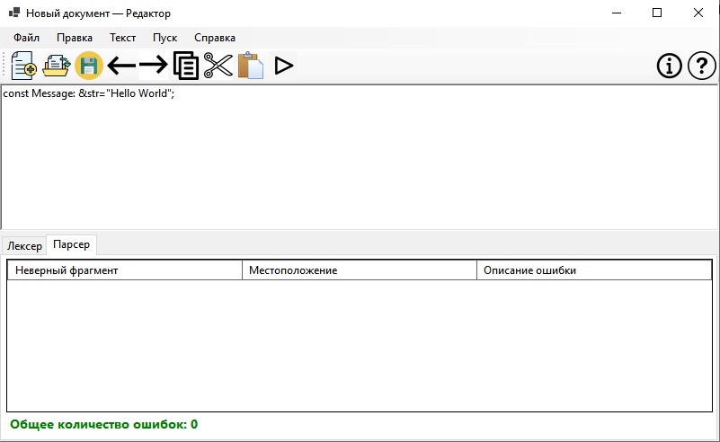
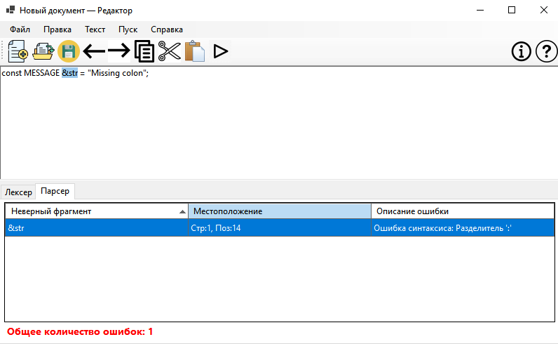
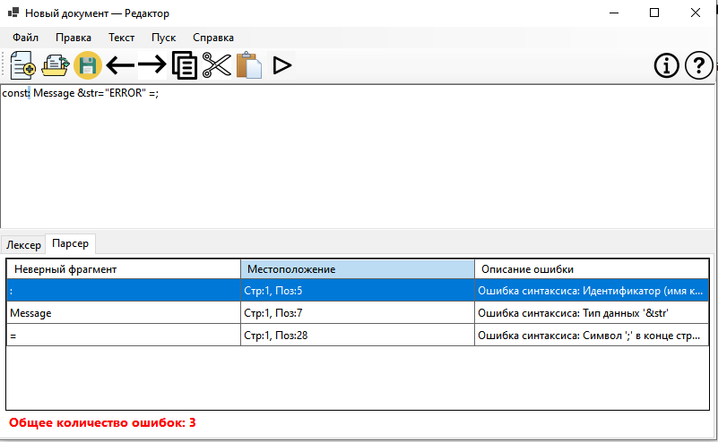

## Лабораторная работа 4. Реализация алгоритма поиска подстрок с помощью регулярных выражений

### Цель работы
Изучить теоретические основы регулярных выражений и их применение для поиска и извлечения подстрок из текста. Освоить практические навыки использования библиотечных средств работы с регулярными выражениями, а также интеграцию алгоритмов поиска в графический интерфейс приложения.

### Постановка задачи
Разработать модуль поиска подстрок на основе регулярных выражений и интегрировать его в текстовый редактор. Программа должна обеспечивать выбор одного из трех типов поиска, выводить результаты в таблицу (фрагмент, позиция, длина) и подсвечивать выбранный результат в тексте.

Вариант задания (3 задачи):

1. Построить РВ, описывающее формат имени файла .doc, .docx, .pdf,  .jpg, .jpeg, .png, .gif (можно выбрать другие 7 форматов файлов).

2. Построить РВ для проверки слов, содержащих подстроку “чай” и имеющих больше 4 символов.

3. Построить РВ, описывающее IP-адрес (v4) с маской подсети. Учесть корректные значения, например, порты находятся в диапазоне от 0 до 65535.

### Решение задач
Задача 1: Форматы имен файлов
Описание: Поиск имен файлов с расширениями .doc, .docx, .pdf, .jpg, .jpeg, .png или .gif. Имя может содержать буквы, цифры, дефис и подчеркивание.

Регулярное выражение:
\b[\w\-]+\.(?:doc|docx|pdf|jpg|jpeg|png|gif)\b

Пояснение обозначений:

\b — граница слова. Она отделяет имя файла от пробелов и знаков препинания.

[\w\-]+ — один или более допустимых символов в имени (исключая пробел).

\. — точка перед расширением.

(?:doc|...|gif) — список разрешенных расширений.

Примеры строк:

Находятся: report.pdf, my-photo.jpg.

Не находятся: taxi.exe (неверный формат), .doc (пустое имя).

Задача 2: Слова с подстрокой «чай»
Описание: Поиск слов, которые содержат в себе сочетание букв «чай» (в любом регистре) и имеют общую длину строго более 4 символов.

Регулярное выражение:
\b(?=[а-яА-ЯёЁ]{5,})[а-яА-ЯёЁ]*чай[а-яА-ЯёЁ]*\b

Пояснение обозначений:

(?=[а-яА-ЯёЁ]{5,}) — проверка, что идущее впереди слово состоит из 5 символов

[а-яА-ЯёЁ]* — любое количество русских букв до и после ключевой подстроки.

чай — обязательная последовательность символов.

\b — ограничители, чтобы захватывать слово целиком.

Примеры строк:

Находятся: чайник, выручай.

Не находятся: чай (<5 букв), чашка (нет подстроки чай).

Задача 3: IPv4-адрес с маской и портом
Описание: Поиск IP-адреса четвертой версии. Включает проверку четырех октетов (0–255), обязательную маску подсети (0–32) и опциональный порт (0–65535).

Регулярное выражение:
\b(?:(?:25[0-5]|2[0-4][0-9]|[01]?[0-9][0-9]?)\.){3}(?:25[0-5]|2[0-4][0-9]|[01]?[0-9][0-9]?)\/(?:[0-9]|[1-2][0-9]|3[0-2])(?::(?:[0-9]|[1-9][0-9]{1,3}|[1-5][0-9]{4}|6[0-4][0-9]{3}|65[0-4][0-9]{2}|655[0-2][0-9]|6553[0-5]))?\b

Пояснение обозначений:

(?:25[0-5]|2[0-4][0-9]|[01]?[0-9][0-9]?) — проверка одного октета: от 250-255, 200-249 или 0-199.

\.{3} — повторение первых трех октетов с точками.

\/([0-9]|[1-2][0-9]|3[0-2]) — обязательный слэш и маска от 0 до 32.

(?:: ... )? — опциональная группа для порта, начинающаяся с двоеточия.

(?:[0-9]| ... |6553[0-5]) — детальная проверка диапазона порта до 65535.

Примеры строк:

Находятся: 192.168.1.1/24, 127.0.0.1/32:8080, 0.0.0.0/0.

Не находятся: 192.168.1.256/24 (число вне диапазона), 172.16.0.1 (нет маски).

### Тестовые примеры
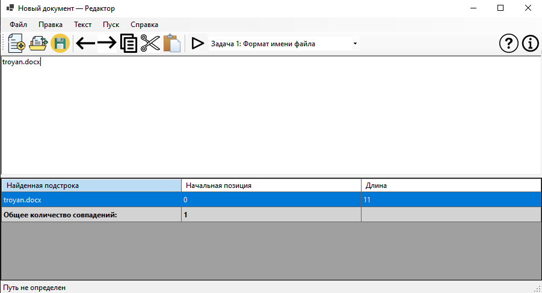
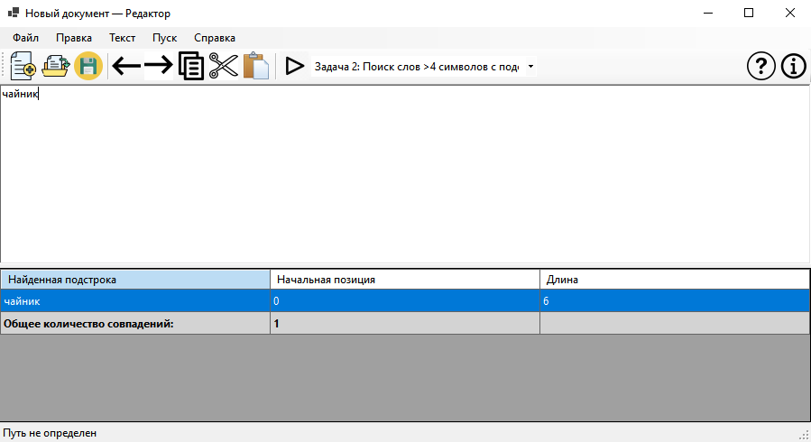
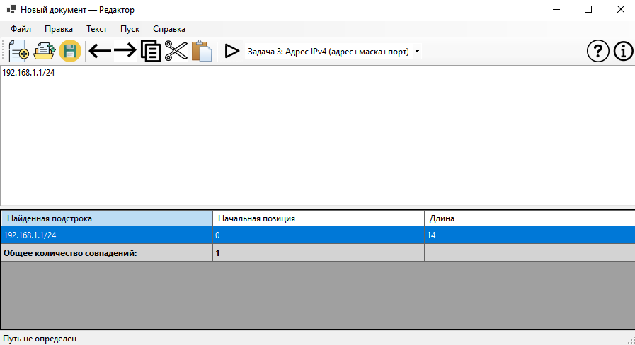
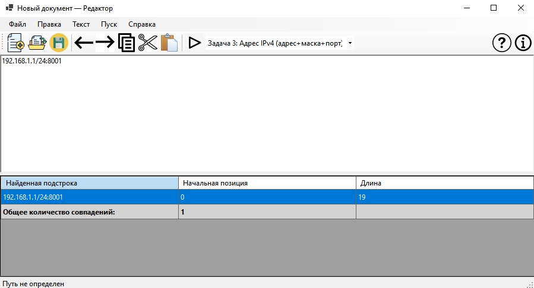
<br><br>

### Граф автомата для второга варинта
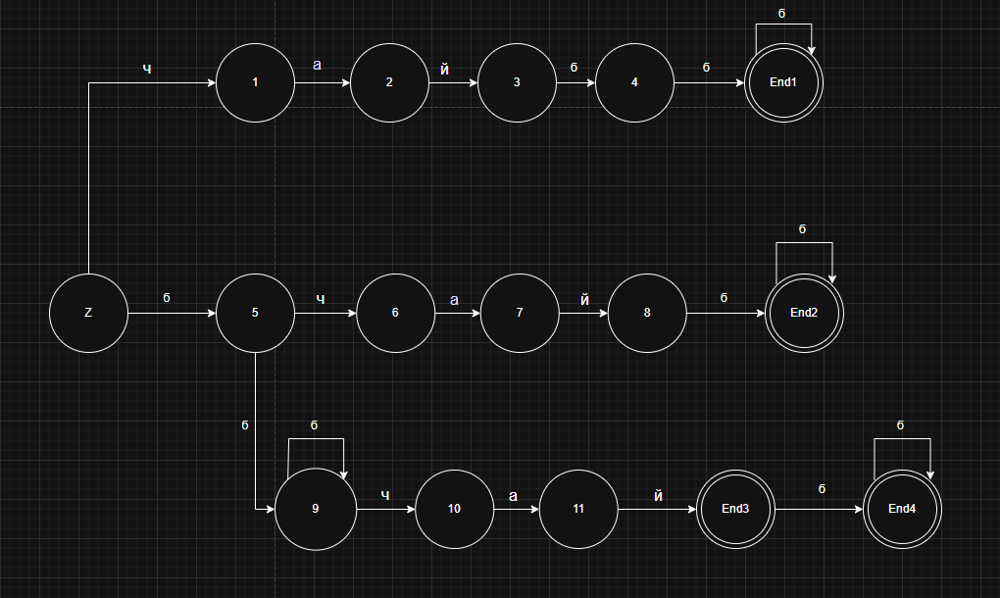

### Примеры с интегрированным автоматом
#### Примеры найденных слов:
##### Подстрока в начале слова:
  * чайник
  * чайка
##### Подстрока в конце слова:
  * автослучай
##### Подстрока в середине слова:
  * нечайно
  * необычайный
#### Примеры слов, которые не находятся:
  * чай

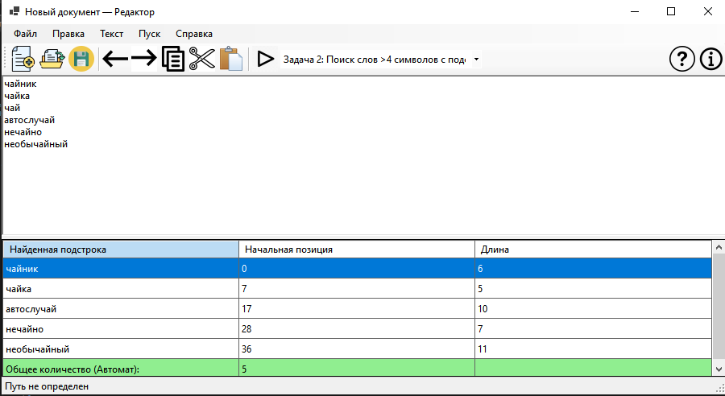

## Лабораторная работа №6: Создание внутренней формы представления программы

**Цель работы:** Изучить методы построения внутреннего представления программы (ВПП) на основе контекстно-свободной грамматики, реализовать синтаксический анализатор методом рекурсивного спуска и преобразовать арифметические выражения в тетрады и ПОЛИЗ.

**Выполнил:** Студент 3 курса, группа АВТ-314, Ткачук Фёдор

**Язык:** Rust
### Полное определение КС-грамматики:
* E → TA
* A → ε | + TA | - TA
* T → FB
* B → ε | * FB | / FB | % FB
* F → num | id | (E)
* id → letter {letter | digit | _}
* num → digit {digit}

### Примеры верных строк:
1. `10 + 20 + 30`
2. `100 / 10 % 3`
3. `2 * (100 - (50 + 20))`

### Диаграмма лексера:
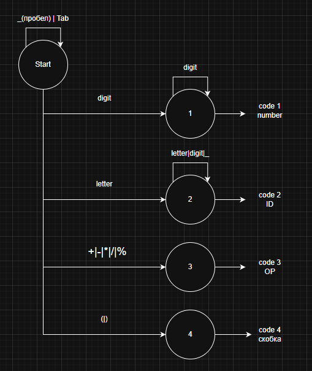
